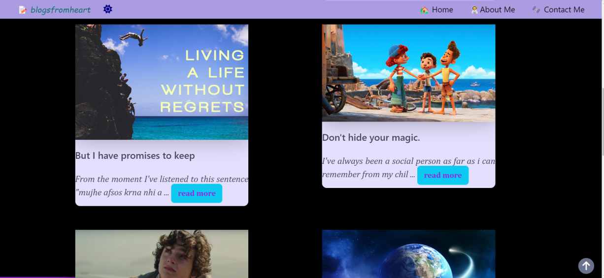
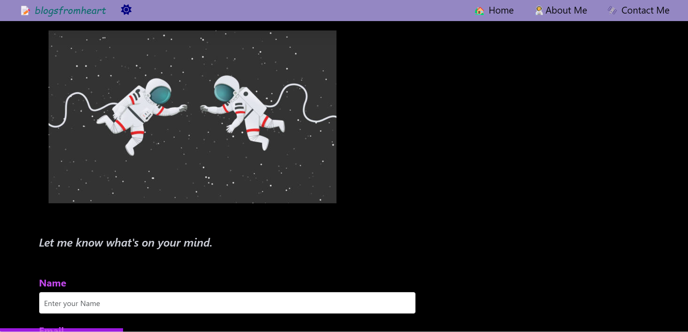

# blog-website 🎸

This is a blog website, i created it as a project while learning from Dr. Angela Yu, on Udemy.
 
I find this platform as a form of self expression, i never knew that i could write blog posts,
that was somewhere hidden inside of me.
 
Thankyou Dr. Angela yu for this wonderful project , i am always grateful for it 💙
 
and thanks to all of my friends to making this website better by giving their valuable feedback 😇

 
you can check my final website here 👉 <a href="https://little-blog-website.onrender.com"> blogsfromheart🎸</a>

<h3> Here are some glimpse of the final product:  </h3>

 
<h4> <em> contact me page  📨 👇</em></h4>

 

<h2> Requirements 🪧 </h2>

 Make sure to install these 👇 before starting to work on this project 🛠️ 

<ul> 
<li> Node js 💚 </li>
<li> MongoDB 🍃 </li>
</ul>

<h2> ✨ Here is how to get started:  ✅ 🚀</h2>
<ul> 
<li> Open command line and type 👉  npm install  🚀</li>
<li> use command 👉 <em> nodemon app.js </em> to open the website on browser </li>
<li> website will open on port 5000 locally. </li>
<li> Make sure to create or update your own .env file, examples are already provided, just fill in the details</li>
<li> Update the .env file to use <em>Compose</em> and <em>Delete </em> routes/pages </li>
</ul>

 

<h2> Things to remember: 🪧 </h2>
<ul>
<li> Update the <em>Favicon </em>, to your own custom image </li>
<li> In post page, update the author image from your own image </li>
<li> Make sure, to update the share links to your own website URL, from line 28, in `post.ejs`  </li>
<li> Make sure to update the social icons links to your own profile </li>
</ul>

 

<h2> Features ⚒️ </h2>
<ul>
<li> Home page using lazy loading and a nice progress bar to keep track of the page </li>
<li> Can send email in a very customized way 📨 </li>
<li> Users can see their name once they click the send button in contacts page </li>
<li> Compose and delete page routes are hidden using .env paths, so only owner can post and modify 🔐</li>
<li> A nice compose page, having current date of the post written and option for adding images 🖼️  </li>
</ul>

<h2>Let's make it better together 😊 </h2>
<ul>
<li>  You can help make this website reponsive. </li>
<li> currently it can work on mobile phones, but that's not very fine </li>
</ul>

<h2> For any query, either create an issue or a pull request.  </h2>
<h3> You can also send me the message using the contact page of the website, link above 👆 for any query </h3>

<h4> 🚀 If you enjoyed building this project and made your very own blog website, kindly share with us, so that we all can appreciate it.  </h4>
 

 <em> with ❤️ prakhar </em> 

